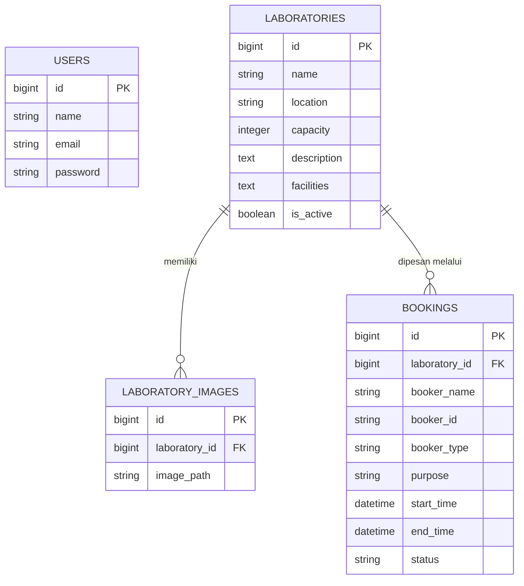

# Sistem Informasi Peminjaman Laboratorium - FEB UMPRI

Sistem Informasi Manajemen Peminjaman Laboratorium khusus untuk Fakultas Ekonomi dan Bisnis (FEB) Universitas Muhammadiyah Pringsewu (UMPRI). Sistem ini dikembangkan untuk memudahkan mahasiswa dan dosen dalam memesan (booking) ruang laboratorium, serta memudahkan admin/petugas dalam mengelola persetujuan peminjaman, data laboratorium, dan konten website.

## Tech Stack

Sistem ini dibangun menggunakan teknologi modern yang berfokus pada kecepatan, keamanan, dan kemudahan _maintenance_:
- **Framework Utama:** Laravel 13 (PHP 8.3+)
- **Frontend / Styling:** Tailwind CSS v3 (JIT Mode)
- **Frontend Interactivity:** AlpineJS (Minimalist JavaScript framework, digunakan untuk _auto-refresh_ jadwal, modal gambar, *dropdowns*)
- **Database:** SQLite (default / _development_) / MySQL (siap produksi)

---

## Fitur dan Menu Sistem

Sistem dibagi menjadi 2 (dua) sisi utama, yaitu **Sisi Publik (Pengguna/Mahasiswa/Dosen)** dan **Sisi Admin**.

### Sisi Publik (Tidak perlu login)
| Fitur / Halaman | Deskripsi |
| --- | --- |
| **Beranda Dinamis** | Menampilkan *Hero Image* (3 gambar *split diagonal*) yang dikustomisasi secara *real-time* oleh Admin. Berisi daftar 3 Laboratorium utama dalam bentuk kartu interaktif. |
| **Detail Laboratorium** | Menampilkan gambar ruangan (*Lightbox Carousel*), menyajikan informasi detail, deskripsi, lokasi, dan fasilitas ruang dengan rapi (*text-justify*). |
| **Jadwal Penggunaan** | Menampilkan jadwal peminjaman yang *sudah disetujui* dengan filter tanggal tanpa *full page reload* (menggunakan *AlpineJS fetch DOM replacement*). |
| **Formulir Booking** | Meminta data nama, NIM/NIDN, status (Mahasiswa/Dosen), tanggal penggunaan, jam, dan keperluan secara langsung di halaman detail lab. |

### Sisi Admin (Memerlukan Login)
| Fitur / Halaman | Deskripsi |
| --- | --- |
| **Dashboard** | Statistik Laboratorium, peminjaman, dan pengguna. Dilengkapi tabel **Live Peminjaman Terbaru** yang *auto-refresh* setiap 10 detik dengan lencana "Live" berkedip (menggunakan sistem *AlpineJS HTTP Polling*). |
| **Manajemen Laboratorium** | Mengedit data lab (Nama, Deskripsi, Fasilitas, Lokasi, Kapasitas) dan mengelola galeri foto untuk masing-masing lab (*multiple upload*). |
| **Manajemen Peminjaman** | Menerima pengajuan jadwal dan memberikan status (Disetujui/Ditolak). Mendukung *Live Polling/Auto-refresh* (sistem *polling* periodik 10 detik) untuk memuat data peminjaman terbaru secara otomatis. |
| **Pengaturan Beranda** | Upload dan kelola 3 gambar utama (*Hero Image*) untuk *Homepage*. |
| **Manajemen Pengguna** | Menambah, mengubah, dan menghapus hak akses Admin lainnya. Sistem terkunci secara bawaan untuk hanya memiliki *role* Admin. |

---

## Struktur Database

Berikut adalah relasi dan struktur tabel di dalam *database* sistem ini:




### Akun Bawaan (Default Credentials)
Demi alasan keamanan, URL akses ke portal administrator serta *username/password* bawaan sistem tidak dipublikasikan secara umum di repositori ini. 
Silakan hubungi pihak pengembang atau periksa dokumen *Handover* internal untuk mendapatkan akses otentikasi awal.

### Letak Penyimpanan File & Gambar (Storage)
Semua file yang diunggah dikelola dengan sistem symlink bawaan Laravel. Letak penyimpanan fisik berada di:
- **Gambar Beranda (Hero):** `storage/app/public/hero/`
- **Gambar Laboratorium:** `storage/app/public/laboratories/`

*Catatan:* Di *server* publik, file-file tersebut dapat diakses pada path url `/storage/hero/` dan `/storage/laboratories/` (berkat adanya _symlink_).

---

## Panduan Setup & Deployment Server

Sistem ini dapat dijalankan pada **Server Fisik (Dedicated)** maupun **VPS**. Mengingat potensi penggunaan Web Server **LiteSpeed / OpenLiteSpeed** atau **Apache/Nginx**, ikuti petunjuk berikut:

### 1. Persiapan Awal
Pastikan server memiliki:
- PHP >= 8.3 (beserta ekstensi: dom, curl, libxml, mbstring, zip, pdo, sqlite3 / pdo_mysql)
- Composer 2.x
- Node.js & NPM (Opsional di server produksi, asalkan Anda sudah menjalankan `npm run build` di lokal sebelum *upload* source code).

### 2. Instalasi (Clone & Dependencies)
1. Unggah *Source Code* atau clone dari repository Git ke direktori server (contoh: `/var/www/lab-feb-umpri` atau di `/home/user/public_html/lab-feb-umpri`).
2. Masuk ke direktori tersebut lewat terminal (SSH) dan jalankan:
   ```sh
   composer install --optimize-autoloader --no-dev
   ```

### 3. Konfigurasi Lingkungan (.env)
1. Salin `cp .env.example .env`.
2. Generate key: `php artisan key:generate`.
3. Atur konfigurasi Database Anda di `.env`. 
   - Jika pakai **MySQL**, ubah `DB_CONNECTION=mysql` lalu isi `DB_DATABASE`, `DB_USERNAME`, `DB_PASSWORD`.
   - Jika pakai **SQLite** (bawaan file), biarkan `DB_CONNECTION=sqlite`. File database ada di `database/database.sqlite`.

### 4. Migrasi & Seed Database
Jalankan migrasi tabel beserta *seeder* awal (untuk membuat 3 lab FEB UMPRI dan akun admin default):
```sh
php artisan migrate --seed
php artisan db:seed --class=LabSeeder
```

### 5. Membuat Storage Link (Penting untuk Gambar)
Agar file yang diupload ke direktori `/storage/app/public/` bisa diakses melalui web browser, jalankan:
```sh
php artisan storage:link
```
*(Jika di shared hosting cPanel/LiteSpeed artisan tidak bisa dijalankan, Anda bisa membuat symlink manual atau letakkan script php kecil berisi `Artisan::call('storage:link')` di route).*

### 6. Build Aset Frontend (Tailwind CSS)
Sistem ini menggunakan kelas-kelas *Tailwind JIT* yang *dynamic*. Jika Anda baru mengubah file `.blade.php` di server (tidak disarankan), jalankan perintah:
```sh
npm install
npm run build
```
*(Direkomendasikan: Build file `public/build/` di komputer lokal, lalu upload/commit ke server tanpa perlu install Node.js di server produksi).*

### 7. Konfigurasi Web Server (Khusus LiteSpeed / Apache)
Laravel mensyaratkan **Document Root (direktori utama)** diarahkan ke dalam folder `/public`.

**Jika menggunakan VPS / Control Panel (cPanel/CyberPanel dll):**
- Arahkan konfigurasi Domain/Subdomain Document Root ke `/home/user/public_html/lab-feb-umpri/public`.
- LiteSpeed secara otomatis akan membaca file `.htaccess` bawaan Laravel yang berada di dalam folder `/public/`. Tidak perlu ada konfigurasi khusus *rewrite rule*.

**Jika server *hardcoded* dan Anda meletakkan folder project di dalam folder `public_html/` biasa (tanpa bisa ubah Document Root):**
Buatlah file `.htaccess` di *root folder* (di luar public) yang memaksa *request* masuk ke `public/`:
```apache
<IfModule mod_rewrite.c>
    RewriteEngine On
    RewriteRule ^(.*)$ public/$1 [L]
</IfModule>
```
Atau lebih disarankan meng-_create symlink_ dari `/public` ke public root direktori web server.

### 8. Hak Akses (Permissions)
Pastikan web server (pengguna `www-data` atau `nobody` atau *user-panel* Anda) memiliki akses tulis ke folder `storage` dan `bootstrap/cache`:
```sh
chmod -R 775 storage bootstrap/cache
chown -R $USER:www-data storage bootstrap/cache
```

Sekarang sistem Anda sudah siap diakses secara online!
