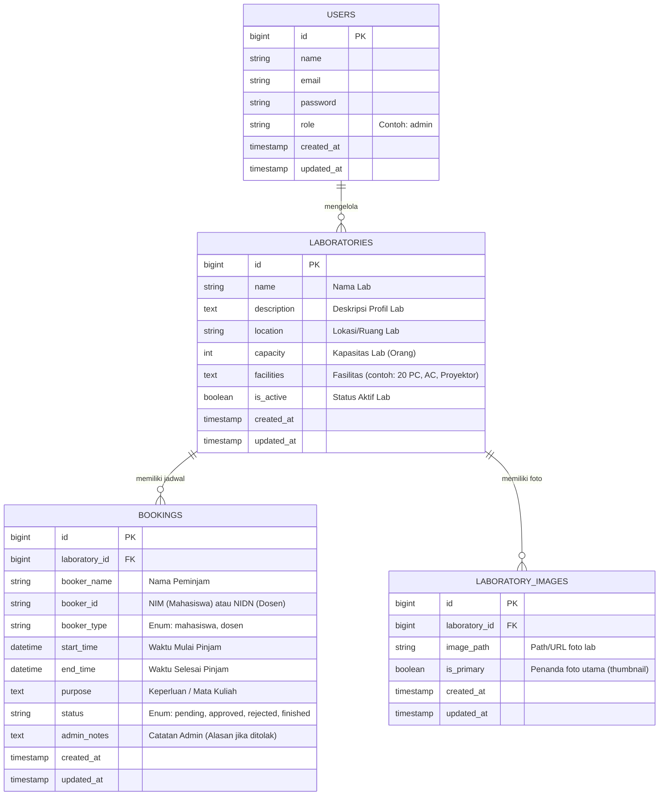

# Dokumen Arsitektur Sistem Informasi Laboratorium FEB UMPRI

## 1. Pendahuluan
Sistem Informasi Laboratorium FEB UMPRI (Universitas Muhammadiyah Pringsewu) adalah sebuah platform berbasis web yang berfungsi sebagai portal profil laboratorium sekaligus sistem manajemen peminjaman (booking) lab. Sistem ini dirancang untuk memudahkan mahasiswa dan dosen dalam melihat informasi lab, mengecek ketersediaan, serta melakukan booking tanpa perlu melakukan proses registrasi/login (guest booking).

## 2. Identifikasi Aktor (Pengguna)
Terdapat dua jenis pengguna utama dalam sistem ini:
1. **Pengguna Publik (Mahasiswa & Dosen)**
   - Tidak memerlukan akun (tanpa login).
   - Dapat melihat daftar laboratorium yang ada di FEB UMPRI.
   - Dapat melihat profil detail setiap laboratorium beserta fasilitasnya.
   - Dapat melihat status penggunaan lab saat ini (sedang digunakan atau kosong) dan jadwal/histori booking.
   - Dapat mengajukan permohonan booking lab melalui form yang disediakan.
2. **Admin / Pengelola Laboratorium**
   - Memerlukan login autentikasi.
   - Mengelola (CRUD) data profil laboratorium dan fasilitas.
   - Menyetujui (Approve) atau Menolak (Reject) permohonan booking yang masuk.
   - Memantau dan mengelola jadwal penggunaan seluruh lab secara terpusat.

## 3. Spesifikasi Teknologi (Tech Stack)
Mengingat kebutuhan sistem yang sederhana dan efisien, berikut adalah tumpukan teknologi (tech stack) yang direkomendasikan:
- **Framework Backend & Fullstack:** Laravel (PHP)
- **Database:** SQLite (Relational Database yang ringan, berbentuk file lokal tanpa perlu setup server database terpisah, sangat cocok dan efisien untuk skala aplikasi ini)
- **Frontend / UI:** Blade Templating Engine (bawaan Laravel).
- **Styling:** Tailwind CSS atau Bootstrap untuk memastikan antarmuka website responsif, rapi, dan modern.
- **Icon & Aset:** FontAwesome atau Heroicons.

## 4. Entity Relationship Diagram (ERD)

Desain database dibuat ramping dan optimal menggunakan 4 tabel utama: `users` (untuk admin), `laboratories` (untuk entitas lab), `laboratory_images` (untuk galeri foto lab), dan `bookings` (untuk data peminjaman).

## 5. Struktur Navigasi (Sitemap)

### 5.1. Sisi Publik (Halaman Depan)
- **Beranda (Home):** Menampilkan sambutan singkat dan *grid/cards* daftar profil semua lab di FEB UMPRI.
- **Halaman Detail Lab (Misal: `/lab/komputer-1`):**
  - Foto Lab, Profil, dan Daftar Fasilitas.
  - **Indikator Status:** Real-time badge (Contoh: 🔴 *Sedang Digunakan* / 🟢 *Tersedia*). Sistem mengecek apakah waktu saat ini berada di antara `start_time` dan `end_time` pada booking yang berstatus `approved`.
  - Kalender atau Tabel Jadwal/Histori Booking lab tersebut (sehingga mahasiswa tahu jadwal yang sudah terisi).
  - Tombol aksi "Ajukan Booking".
- **Halaman Form Booking:** Form pengisian pengajuan (Nama, NIM/NIDN, Waktu, Keperluan).

### 5.2. Sisi Admin (Panel Kontrol)
- **Halaman Login:** Akses masuk pengelola.
- **Dashboard Admin:** Ringkasan statistik (jumlah lab, total request booking masuk bulan/hari ini, jadwal hari ini).
- **Manajemen Laboratorium:** Halaman untuk Tambah/Edit/Hapus profil lab.
- **Manajemen Booking:**
  - Tab "Permohonan Baru" (*Pending*). Admin bisa klik "Approve" atau "Reject".
  - Tab "Jadwal Disetujui" (*Approved*).
  - Tab "Riwayat Peminjaman".
- **Pengaturan Akun:** Ubah profil dan password admin.

## 6. Alur Bisnis (Business Flow)

### 6.1. Alur Peminjaman (Guest Booking Flow)
1. **Pilih Lab:** Mahasiswa/Dosen membuka website dan memilih salah satu Lab dari halaman Beranda.
2. **Cek Jadwal:** Pengguna melihat jadwal pada halaman Detail Lab untuk memastikan lab kosong pada rentang waktu yang diinginkan.
3. **Isi Form:** Pengguna menekan tombol "Booking Lab Ini" dan sistem menampilkan formulir.
4. **Input Data:** Pengguna mengisi: Nama, NIM/NIDN, Status (Mahasiswa/Dosen), Waktu Mulai, Waktu Selesai, dan Keperluan.
5. **Submit:** Sistem memvalidasi apakah ada bentrok jadwal. Jika aman, data disimpan ke tabel `bookings` dengan status `pending`.
6. **Selesai:** Pengguna diarahkan ke halaman detail lab kembali dengan notifikasi sukses ("Pengajuan booking berhasil, menunggu persetujuan pengelola").

### 6.2. Alur Persetujuan (Admin Flow)
1. **Login:** Admin login ke dashboard.
2. **Review:** Admin masuk ke menu "Manajemen Booking" dan melihat permohonan baru yang `pending`.
3. **Tindakan (Action):**
   - Jika Disetujui (**Approve**): Status berubah menjadi `approved`. Jadwal akan langsung tayang di halaman publik (Detail Lab).
   - Jika Ditolak (**Reject**): Status berubah menjadi `rejected`. Admin bisa menyertakan alasan penolakan.
4. **Monitoring:** Saat waktu pelaksanaan tiba, status lab di sisi publik otomatis berubah menjadi "Sedang Digunakan".

## 7. Logika & Aturan Validasi Khusus
Meskipun pengguna publik tidak perlu login, sistem mencegah penyalahgunaan dengan aturan:
- **Pencegahan Bentrok Jadwal (Double Booking):** Saat user submit form booking, controller Laravel akan mengecek tabel `bookings`. Jika ada jadwal dengan status `approved` di lab yang sama, yang waktunya beririsan (*overlapping*) dengan waktu yang diajukan, maka form akan mengembalikan pesan *Error: Jadwal tidak tersedia di waktu tersebut*.
- **Keamanan Anti-Spam:** Menerapkan form CAPTCHA sederhana atau *rate-limiting* pada IP untuk form booking agar tidak di-*spam*.
- **Logika Status Live:** Status "Sedang Digunakan" di halaman publik murni ditarik secara dinamis dengan kueri: `WHERE laboratory_id = X AND status = 'approved' AND NOW() BETWEEN start_time AND end_time`.

## 8. Identitas Visual (Visual Identity) & UI Design
Desain antarmuka website akan mengusung tema **minimalis biasa**. Pendekatan pewarnaan sepenuhnya menggunakan warna-warna solid yang tegas, bersih, dan menghindari penggunaan gaya gradien (*gradients*).

- **Gaya Desain:** Minimalis, *flat design* dengan tata letak (*layout*) yang rapi, luas, dan mudah dipahami.
- **Warna Utama (Primary Color):** Biru UMPRI `rgb(30, 58, 138)` atau setara dengan Hex `#1E3A8A`. Warna ini digunakan sebagai nyawa visual utama aplikasi, diterapkan pada komponen *Navbar*, tombol *Call to Action* (seperti "Ajukan Booking"), dan elemen penanda lainnya.
- **Warna Latar (Background):** Putih bersih atau abu-abu terang solid (misal: `#F3F4F6`) guna memberikan kontras yang maksimal dengan elemen biru UMPRI.
- **Warna Teks:** Gelap solid (hitam atau abu-abu tua) untuk tingkat keterbacaan yang optimal.

## 9. Rencana Implementasi
1. **Fase Inisialisasi:** Pembuatan kerangka proyek Laravel (`composer create-project laravel/laravel`) dan setup SQLite (`database.sqlite`).
2. **Fase Database:** Pembuatan *Migration* dan *Model* beserta relasi Eloquent-nya.
3. **Fase Backend Admin:** Pembuatan fitur autentikasi admin dan halaman manajemen CRUD (Bisa diakselerasi menggunakan package *FilamentPHP* agar panel admin cepat selesai dan profesional).
4. **Fase Frontend Publik:** Pembuatan halaman profil, kalender histori, dan form booking menggunakan Blade dan TailwindCSS.
5. **Fase Validasi & Testing:** Pengujian logika double booking, pengujian tampilan responsif di mobile, dan finalisasi.
